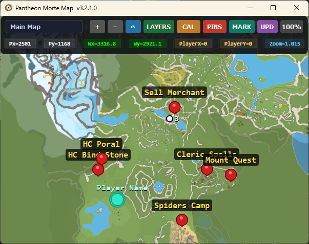
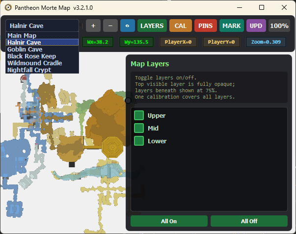
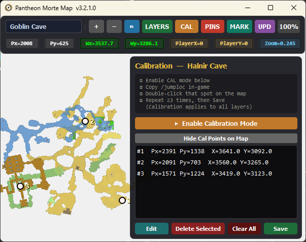
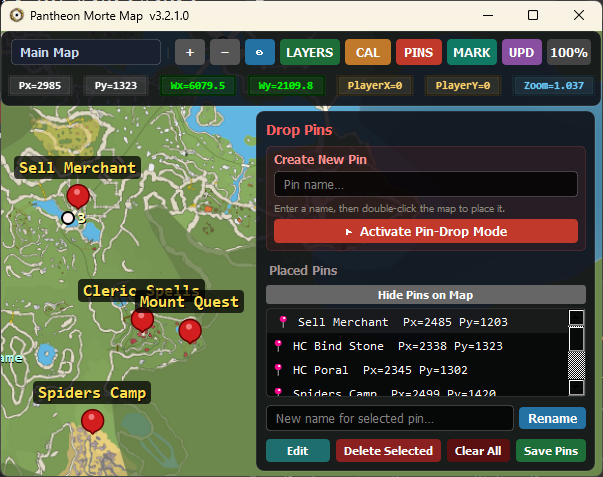
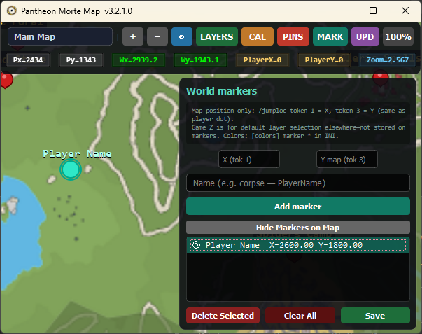

<h2 align="center">Preview</h2>

<table align="center">
  <tr>
    <td align="center">
      <b>Main Window</b><br>
      
    </td>
    <td align="center">
      <b>Maps Layers</b><br>
      
    </td>
  </tr>
  <tr>
    <td align="center">
      <b>Calibrations</b><br>
      
    </td>
    <td align="center">
      <b>Map Pins</b><br>
      
    </td>
  </tr>
</table>

<p align="center">
  <b>Map Markers</b><br>
  
</p>


# Pantheon Morte Map

**Pantheon Morte Map** is a Windows tool for mapping, calibrating, and managing points on the Pantheon map. Use it to accurately locate your position and track points of interest.

> ⚠️ **Important:** You must be out of the game before updating your position. Always use `/loc` in-game to refresh your location.

---

## Quick Start

1. Download the `pantheon_morte_map.exe` file.
2. Make sure all map images (`*.png`) are in the `Maps/` folder.
3. Open the exe and calibrate your map (see [Calibration Instructions](#calibration-instructions)).
4. Click around the map to view or store pins.

> This lets new users get started in seconds without needing Python.

---

## Table of Contents

1. [Features](#features)
2. [Installation](#installation)
3. [Calibration Instructions](#calibration-instructions)
4. [Dependencies](#dependencies)
5. [File Structure](#file-structure)
6. [Contributing](#contributing)
7. [License](#license)

---

## Features

* Load and display Pantheon map images from the `Maps` folder.
* Calibrate maps using at least 3 separate points for accurate positioning.
* Store pins and calibration data in external JSON files.
* Windows-focused, portable executable for easy use.

---

## Installation

### 1. Install Python dependencies (optional if using `.exe`)

If you want to run the Python source, install the required packages:

```bash
pip install pyqt5 pyperclip numpy
```
### 2. Installing PIP on Windows

If you don’t have `pip` installed:

1. Download [get-pip.py](https://bootstrap.pypa.io/get-pip.py)
2. Open Command Prompt and run:

```bash
python get-pip.py
```

3. Verify installation:

```bash
pip --version
```

> If you’re using the `.exe`, Python and pip are not required.

---

## Calibration Instructions

1. Open [Shalazam Maps](https://shalazam.info/maps) in a browser.
2. Load the map you want to use.
3. Right-click a location on the web map → `Copy to Clipboard` → `Copy /jumplocto clipboard`.
4. Open **Morte Map**.
5. Click the **Orange CAL button** → Enable **Calibration Mode**.
6. Double-click the same spot on the Morte Map.
7. Repeat for **at least 3 separate calibration points** on the map, not close together.
8. Click **SAVE** to store calibration.

> ⚠️ Proper calibration ensures your location updates accurately when using `/loc` in-game.

---

## Dependencies

* Python 3.8+ (only needed if using `.py` source)
* PyQt5
* pyperclip
* numpy
* Standard Python libraries: `sys`, `time`, `threading`, `json`, `os`, `configparser`

> If you’re using the `.exe`, dependencies are already included.

---

## File Structure

```text
pantheon-morte-map/
│
├─ pantheon_morte_map.exe            # Compiled executable for Windows
├─ Maps/
│   └─ *.png                         # Map images
├─ Settings/
│   ├─ calibration_main_map.json     # Calibration data for main map
│   ├─ config.ini                    # Configuration settings
│   └─ pins_main_map.json            # Stored pins for main map
├─ README.md
├─ LICENSE
└─ .gitignore
```

---

## Contributing

* Fork the repository.
* Submit bug reports or feature requests via GitHub Issues.
* Avoid uploading scraper scripts to prevent overloading external map sites.

---

## License

This project is licensed under the **MIT License** – see the [LICENSE](LICENSE) file for details.
